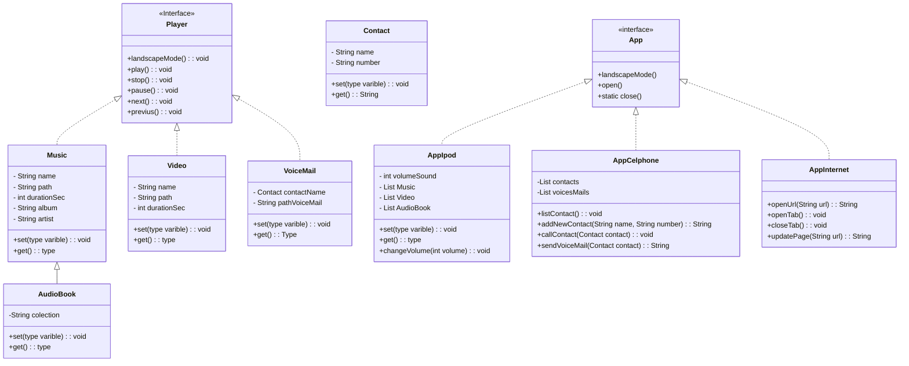

# [DIO](www.dio.me) - Trilha Java Básico

## Professor
- [Gleyson Sampaio](https://github.com/glysns)

## POO - Desafio

### Modelagem e Diagramação de um Componente iPhone

Neste desafio, você será responsável por modelar e diagramar a representação UML do componente iPhone, abrangendo suas funcionalidades como Reprodutor Musical, Aparelho Telefônico e Navegador na Internet.

#### Contexto
Com base no vídeo de lançamento do iPhone de 2007 (link abaixo), você deve elaborar a diagramação das classes e interfaces utilizando uma ferramenta UML de sua preferência. Em seguida, implemente as classes e interfaces no formato de arquivos `.java`.

[Lançamento iPhone 2007](https://www.youtube.com/watch?v=9ou608QQRq8)
- Minutos relevantes: 00:15 até 00:55

### Instruções
1. Assista ao vídeo do lançamento do iPhone para entender as funcionalidades principais.
2. Utilize uma ferramenta UML de sua preferência para criar o diagrama das classes e interfaces. Você pode utilizar o modelo acima (criado na sintaxe [Mermaid](https://mermaid.js.org/)), uma alternativa open-source e compatível com arquivos Markdown como este.
3. Opcionalmente, caso esteja cheio(a) de confiança, pode implementar as classes Java representadas em seu diagrama UML.
4. Submeta seu repositório GitHub conforme as orientações da plataforma DIO. Por exemplo:

```bash
https://github.com/glysns/trilha-java-basico/desafios/poo/README.md
````
----

# Atividade realizada

### **Funcionalidades**  

1. **Reprodutor Multimídia (Player)**  
   - Métodos:  
     - `play()`: Inicia a reprodução do conteúdo (música, vídeo ou audiobook).  
     - `stop()`: Interrompe a reprodução e volta no começo.
     - `pause()`: Interrompe a reprodução e fica no estado que foi parado.
     - `next()`: Segue para a proxima reprodução.
     - `previus()`: Volta a reprodução anterior.
     - `landscapeMode()`: Ativa o modo paisagem (para vídeos).  

2. **Gerenciador de Mídia (AppIpod)**  
   - Métodos:  
     - `changeVolume(int volume)`: Ajusta o volume do player.  
     - `get()`: Recupera informações da mídia (música, vídeo ou audiobook).  
     - `set()`: Define propriedades da mídia.  

3. **Telefone e Correio de Voz (AppCelphone)**  
   - Métodos:  
     - `addNewContact(String name, String number)`: Adiciona um novo contato.  
     - `callContact(Contact contact)`: Realiza uma chamada.  
     - `sendVoiceMail(Contact contact)`: Envia uma mensagem de voz.  
     - `listContact()`: Lista todos os contatos.  

4. **Navegador de Internet (AppInternet)**  
   - Métodos:  
     - `openUrl(String url)`: Carrega uma página web.  
     - `openTab()`: Abre uma nova aba.  
     - `closeTab()`: Fecha a aba atual.  
     - `updatePage(String url)`: Atualiza a página exibida.  

5. **Aplicativo Base (App)** *(Interface)*  
   - Métodos:  
     - `open()`: Inicia o aplicativo.  
     - `close()`: Fecha o aplicativo (método estático).  
     - `landscapeMode()`: Alterna para modo paisagem (herdado por apps específicos).  

6. **Gerenciamento de Mídias Específicas**  
   - **Música**:  
     - `set()`/`get()` para nome, álbum e artista.  
   - **Vídeo**:  
     - `set()`/`get()` para nome e caminho do arquivo.  
   - **Audiobook**:  
     - `set()`/`get()` para coleção.  
   - **Correio de Voz (VoiceMail)**:  
     - `get()` para mensagem e contato associado.  

---

### **Observações**  
- **Heranças/Implementações**:  
  - `AppIpod`, `AppCelphone` e `AppInternet` implementam a interface `App`.  
  - `Music`, `Video` e `VoiceMail` implementam a interface `Player`.  
  - `AudioBook` herda de `Music` (relação especializada).  
- **Destaques**:  
  - O `AppIpod` gerencia listas de músicas, vídeos e audiobooks.  
  - O `AppCelphone` possui composição com `Contact` e `VoiceMail`.  

### Diagrama UML (Mermaid)



